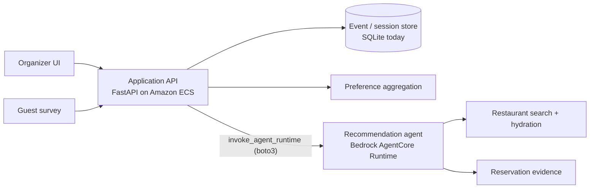
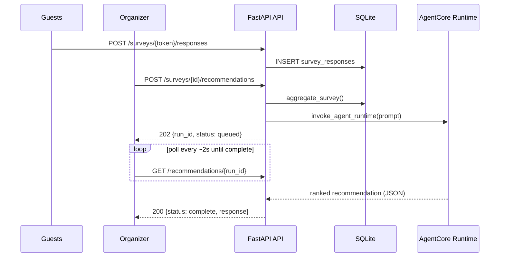

# Group Reservations Architecture

Rendered diagrams (system architecture, technical stack, and a worked
request-flow example with sample data) live in
[`docs/diagrams/`](./docs/diagrams/). The Mermaid diagrams below render
inline on GitHub and track the same facts at a lighter level of detail.

## AgentCore runtime layout

AgentCore is a single project rooted at `agentcore/`. The runtime adapter and
its Dockerfile live in `app/waweagent/`; the repository root is the explicit
Docker build context because the image installs the package from `src/`.

```text
repository root
├── app/waweagent/       # main.py, Dockerfile, runtime policy file
├── src/                 # groupreservations package
├── frontend/
└── agentcore/           # agentcore.json, targets, CDK project
```

`.dockerignore` reduces that root context to `pyproject.toml`, `src/`, and
the adapter files. Validate the image with plain Docker before running
`agentcore deploy`.

## System context



The organizer owns the event. Guests own only their response. The public URL
must never grant access to organizer controls. The API and the agent are two
independently deployed services: the API never runs agent logic in-process,
it invokes the deployed AgentCore runtime for every recommendation.

### Identity and third-party session isolation

```text
Authorization: Bearer <our JWT>
        -> verify signature, audience, expiry
        -> sub = organizer_id
    -> create organizer-scoped browser session
    -> browser state stays in that user's namespace
```

The JWT identifies the user to our application. Browser state is scoped to the
organizer and should use encrypted per-user session storage in production.

## Components

- `models.py`: canonical `Place` and `AvailabilityEvidence` structs. `Place`
  includes Google’s `reservable` flag, which indicates reservation support but
  not live date/time availability.
- `adapters/google_places.py`: REST calls to Google Places search and details.
- `places_tools.py`: Strands-compatible tools that search and immediately
  hydrate Google restaurant candidates.
- `agent.py`: Bedrock-backed Strands agent and organizer-scoped browser
  reservation workflow. Google Places owns discovery; provider pages are
  inspected through explicit, verified browser candidates.
- `reservation_browser.py`: serialized Playwright browser tools. After
  candidate verification, `reservation_sweep` returns an unclassified map of
  the rendered page and frames with DOM regions, accessibility evidence, and a
  screenshot. Each returned surface receives a stable `workflow_id` and its
  own Playwright page association; the agent carries that handle through
  expansion, preparation, and interaction while the browser resolves the
  underlying surface without cross-workflow navigation. The agent selects a region;
  `reservation_expand` provides its detailed controls. `reservation_prepare`
  then prepares an exact URL selected from that evidence. `reservation_operate` is the bounded convenience flow
  for standard widgets. `reservation_act` is
  the generic semantic action boundary for unfamiliar widgets: the agent picks
  an observed label/action while the browser owns frame resolution, identity,
  re-observation, and final-action safety.
- `agent_state.py`: serializable invocation state and tool affordances shared by
  the agent and browser layer. It records phase, blockers, current page,
  workflow state, structured recovery errors, and permitted next actions
  without exposing model chain-of-thought.
- `api.py`: FastAPI HTTP boundary accepting structured survey responses and
  invoking the deployed AgentCore runtime through `agentcore_client.py`. It
  owns the short-lived recommendation run handle and internal continuation
  context; status responses expose only the validated recommendation envelope,
  never the raw agent answer, prompt, or internal state. Allowlisted follow-up
  actions resume the same `run_id` and AgentCore session.
- `agentcore_client.py`: AWS SDK data-plane client for `InvokeAgentRuntime`.
  The ECS API does not run a second local agent; production requires
  `AGENTCORE_RUNTIME_ARN`.
- `database.py`: SQLite persistence mirroring the production schema. `users`
  stores organizers and temporary guests; `surveys`, `survey_questions`, and
  `survey_options` store the invitation; `survey_responses` and
  `response_answers` store independent guest submissions.
- `auth.py`: application JWT minting/verification and safe organizer IDs.
- `config.py`: environment-backed AWS, Google, and JWT settings.

## API contract and hardening

The API supports the event lifecycle with `POST /api/surveys`, `GET` survey
and organizer-shelf reads, `PATCH /api/surveys/{survey_id}`, and
`DELETE /api/surveys/{survey_id}`. Updates and deletes are organizer-scoped;
the local demo may use `X-Organizer-Id`, while deployed environments should
set `GROUP_RESERVATIONS_REQUIRE_AUTH=true` and use an application JWT bearer
token.

CORS is configured through `GROUP_RESERVATIONS_CORS_ORIGINS` as a comma-separated
allowlist, with local origins as the default and Vercel preview origins
accepted by the `vercel.app` origin pattern. Set the production Vercel or
custom-domain origin explicitly in the allowlist.

The API applies an in-process sliding-window rate limiter keyed by client IP,
method, and route. Recommendation starts, guest response writes, and account
or survey creation have stricter limits than ordinary reads. Production should
also enforce an edge/API-Gateway limiter because process-local state is not
shared across replicas.

The repository now contains a local web API and static multi-page survey UI. The local
SQLite schema mirrors durable production storage, while Cognito and Aurora
PostgreSQL are the production targets. SMS delivery remains a planned
application component. The local API exposes deterministic aggregation before
agent orchestration.

The browser flow uses one HTML entrypoint per product state: `landing.html`,
`event-creation.html`, `survey-creation.html`, `share-event.html`,
`guest-survey.html`, `organizer-events.html`, `event-overview.html`, and
`recommendations.html`. `index.html` remains only as a compatibility redirect
for old links. The former all-in-one `app.js` screen router is retired.

## Data Flow

```text
frontend survey payload
    -> POST /api/users or /api/surveys or /api/surveys/{token}/responses
    -> Google Places Autocomplete + Place Details for city/origin selection
    -> SQLite normalized survey tables (Aurora PostgreSQL in production)
    -> GET /api/surveys/{survey_id}/aggregate
    -> preference counts and cleaned response context
    -> POST /api/surveys/{survey_id}/recommendations
    -> structured request validation
    -> queued recommendation run (`run_id`)
    -> agent prompt + AgentCore session
    -> survey_get_evidence fallback when context is missing or ambiguous
    -> google_places_search
    -> Google Places searchText
    -> get_place for every candidate
    -> hydrated Place structs + source/opening-hours evidence
    -> reservation-page inspection and non-final availability checks for selected Place candidates
    -> explicit agent state + browser available_actions after each observation
    -> ranked explanation with evidence and uncertainty
    -> explicit organizer confirmation
    -> explicit organizer confirmation + external booking handoff
```

The frontend polls `GET /api/recommendations/{run_id}` until the run reaches a
terminal state. A contract action such as `refresh_research` is sent to
`POST /api/recommendations/{run_id}/actions`; the API reuses the run's
AgentCore session and includes the last validated contract as bounded context.



Agent observability is provided by lifecycle hooks. Trace records capture the
phase, tool, sanitized input, result summary, evidence/source references,
transition reason, state changes, and final status without logging private
model reasoning.

Google Place IDs are the canonical restaurant identity passed into later
restaurant-page inspection. Embedded provider URLs, including Toast iframe
URLs, are promoted to explicit candidate actions and must be opened and
verified before availability controls can be used. Missing availability
evidence remains unknown; final booking confirmation remains organizer-gated.

Multi-step reservation forms and bot detection on large platforms make
automated verification unreliable against some providers today; this is a
real, known limitation, not an edge case. The near-term plan is to validate
with real usage first — regular friend-group organizers actually using this
— and only then pursue official developer API integrations with providers
such as Toast, OpenTable, and Resy, rather than investing further in browser
automation against anti-bot defenses.

## Domain objects

- `Event`: organizer, title, status, response URL/token, survey, candidate
  dates, and a date-to-time availability map. A time slot belongs only to the
  date where the organizer configured it; the aggregate must not create a
  cross-product of every date and every time.
- `SurveyQuestion`: stable key, prompt, answer type, options, and active state.
- `GuestResponse`: event, opaque respondent token, structured answers,
  submitted timestamp, and revision timestamp.
- `PreferenceSummary`: response count, participation rate, per-option support,
  conflicts, and confidence.
- `GuestOrigin`: optional selected Google Place ID, display label, and
  coordinates for approximate guest travel origin; exact home addresses are
  not required or stored.
- Guest budget answers use explicit per-person bands. Guest distance answers
  use a numeric maximum restaurant radius from the meetup location, with a
  30+ mile endpoint for dispersed groups; guest home locations are not
  collected in the MVP.
- `RestaurantCandidate`: canonical Google Place plus group-fit score.
- `AvailabilityEvidence`: reservation/waitlist result, source URL, and
  checked timestamp for each candidate/date/time combination.
- `GroupRecommendation`: ranked top three options with score breakdown and
  uncertainty.

## Recommendation pipeline

```text
survey answers
    -> validate and aggregate preferences
    -> select feasible date/time windows from the date-specific availability map
    -> search and hydrate restaurant candidates
    -> check reservation evidence for feasible windows
    -> deterministic scoring
    -> agent explanation and top-three presentation
```

The aggregate and score should remain deterministic and testable. The agent
can choose which candidates to investigate and explain tradeoffs, but it must
not invent guest preferences or turn missing availability evidence into a
positive recommendation.

## Security and privacy

- Use an opaque, revocable response token; do not put guest answers in the URL.
- Rate-limit public response submission and make submissions idempotent.
- Keep organizer authentication and guest participation as separate concerns.
- Store the minimum guest identity needed for the event; anonymous responses
  are the default.
- Never expose the response list through a guest-facing endpoint.

## What is deliberately not shared with HungryRadar yet

The event lifecycle, survey model, guest access model, aggregation rules, and
group ranking are new domain concepts. They should be implemented here first.
If both products later need common code, extract a small neutral package only
after both implementations establish the same contract.
