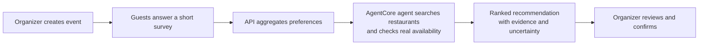

# Where Are We Eating?

An agent that turns "let's figure out where to eat" from an unanswered group
text into a ranked, evidence-checked restaurant recommendation — no app to
install, no account to create.

## The problem

Any group that has to agree on a restaurant knows the ritual: a text thread,
a poll nobody finishes, someone picking a place half the group didn't want.
It's a small problem, but it repeats constantly, and it's exactly the kind of
everyday coordination friction that keeps small groups — the ones that don't
have an events budget or a designated planner — from getting together as
often as they'd like.

## Who it's for

Any group of people who need to agree on a restaurant without a group-chat
spiral: friend groups, book clubs, neighborhood associations, congregations,
coworkers, family reunions. The organizer creates the event and owns the
decision; guests answer a short survey anonymously, with no account
required. The pattern generalizes to any small group that needs one person
to turn scattered preferences into a single confident answer.

## Why it matters

Coordination overhead is a tax that falls hardest on the groups least
equipped to pay it — the ones without a dedicated organizer or a budget for
event-planning tools. Lowering that tax by a few minutes, for free, adds up
over a lot of Friday nights.

## How it works



1. **Organizer creates an event** — a title, a few candidate dates and
   times, and a short set of survey questions (cuisine, budget, dietary
   needs, travel distance).
2. **Guests answer anonymously** via a shared link — no account, under 30
   seconds.
3. **The API deterministically aggregates** responses into vote counts,
   participation rate, and a confidence score, *before* any model call.
4. **The agent (Strands on Bedrock, hosted on Amazon Bedrock AgentCore
   Runtime)** searches Google Places for candidates, then inspects each
   restaurant's real reservation page to check actual availability — it
   never turns missing evidence into a positive claim.
5. **The organizer reviews three ranked options**, each with its evidence
   and a plain-language explanation, and confirms the booking directly with
   the restaurant. Nothing is booked automatically.

For the full technical design — including what's real today versus what's
planned — see [`ARCHITECTURE.md`](./ARCHITECTURE.md). Rendered architecture,
stack, and request-flow diagrams live in [`docs/diagrams/`](./docs/diagrams/).

## Project Structure

```
repository-root/
├── app/
│   ├── api/                # FastAPI service Dockerfile (deployed to Amazon ECS)
│   └── waweagent/          # AgentCore HTTP adapter (main.py, Dockerfile)
├── src/groupreservations/  # Application package: api.py, agent.py, database.py, ...
├── frontend/               # Static browser client (Vercel)
├── agentcore/              # AgentCore project config, CDK infra
├── docs/diagrams/          # Rendered architecture/stack/request-flow diagrams
└── tests/
```

The FastAPI service and the AgentCore-hosted agent are two independently
deployed pieces: the API calls the deployed AgentCore runtime via
`boto3`'s `bedrock-agentcore` client (`invoke_agent_runtime`) for every
recommendation. See `ARCHITECTURE.md` for the full component and deployment
diagram.

## Getting Started

### Prerequisites

- **Node.js** 20.x or later
- **Python 3.11+** and **uv** for the Python package
  ([install uv](https://docs.astral.sh/uv/getting-started/installation/))
- **AWS credentials** configured (`aws configure` or environment variables)
- **Docker** (for building either container image)

### Run the API locally

```bash
PYTHONPATH=src uvicorn groupreservations.api:app --reload
```

### Run the AgentCore adapter locally

```bash
PYTHONPATH=src python app/waweagent/main.py
```

Test either container before deploying:

```bash
docker build -t waweagent -f app/waweagent/Dockerfile .
docker run --rm -p 8080:8080 waweagent
curl http://localhost:8080/ping
```

### Deploy

The API image builds and rolls out to ECS automatically on every push to
`main` (see `.github/workflows/`). Deploy the AgentCore runtime with:

```bash
agentcore deploy
```

## AgentCore project reference

This repository's `agentcore/` directory is one AgentCore project. The
container build for the AgentCore runtime uses the repository root as its
explicit Docker context so it can install `src/`, while `.dockerignore`
excludes frontend assets, tests, local state, secrets, and generated
infrastructure dependencies.

The project uses a **flat resource model** — agents, memories, credentials,
gateways, evaluators, and policies are top-level arrays in
`agentcore/agentcore.json`. Resources are independent; agents discover
memories and credentials at runtime via environment variables or SDK calls.

| Command | Description |
| --- | --- |
| `agentcore create` | Create a new AgentCore project |
| `agentcore add` | Add resources (agent, memory, credential, gateway, evaluator, policy) |
| `agentcore remove` | Remove resources |
| `agentcore dev` | Run agent locally with hot-reload |
| `agentcore deploy` | Deploy to AWS via CDK |
| `agentcore status` | Show deployment status |
| `agentcore invoke` | Invoke agent (local or deployed) |
| `agentcore logs` | View agent logs |
| `agentcore traces` | View agent traces |

### Documentation

- [AgentCore CLI](https://github.com/aws/agentcore-cli)
- [AgentCore CDK Constructs](https://github.com/aws/agentcore-l3-cdk-constructs)
- [Amazon Bedrock AgentCore](https://aws.amazon.com/bedrock/agentcore/)
